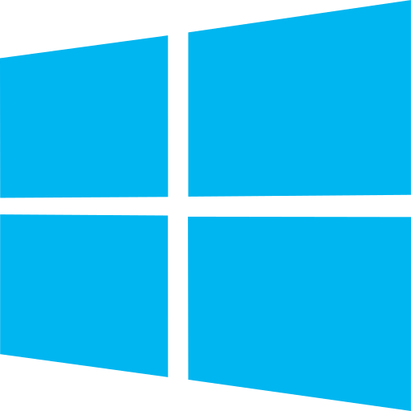
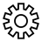
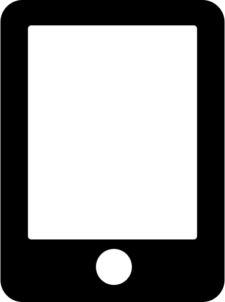
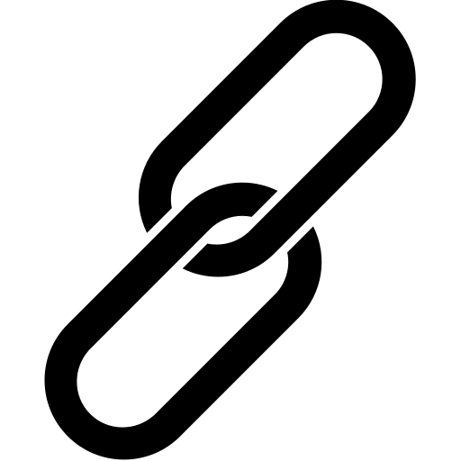
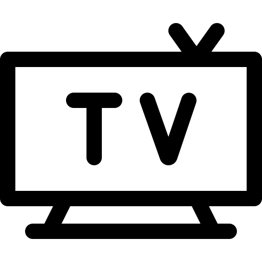
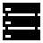
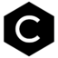

<!--Message to the programmer.:-->


<h1 align="center" style="color:pink; font-size:24px;"><strong>Promo.Claims or was it Claims.Promo</strong></h1>
<div align="center"><table style="color: white; background-color: pink;">
            <tr>
       <td align="center" style="width: 100px;"></td>
    <td align="center" style="width: 100px;"></td>
    <td align="center" style="width: 100px;"></td>
    <td align="center" style="width: 100px;"></td>
            <td align="center" colspan="2"  rowspan="2"> +   +  =  
             <a href="https://github.com/How-do-i-get-your-attention/promo.claims-or-was-it-claims.promo/tree/master#the-history-starts-from-the-1960s-with-arpanet-connecting-everyone-through-the-internet">
                        
                        </a>
             </td>
  </tr>
      <tr>
       <td align="center" style="width: 100px;"></td>
    <td align="center" style="width: 100px;">
                <a href="https://github.com/How-do-i-get-your-attention/promo.claims-or-was-it-claims.promo/tree/master#android-studio">
                  
                </a>
                  </td>
    <td align="center" style="width: 100px;">  </td>
    <td align="center" style="width: 100px;">  </td>
       
  </tr>
   <tr>
    <td align="center" style="width: 100px;">
               <a href="https://github.com/How-do-i-get-your-attention/promo.claims-or-was-it-claims.promo/tree/master#the-history-starts-from-the-1960s-with-arpanet-connecting-everyone-through-the-internet">
                        
                        </a>
               </td>
    <td align="center" style="width: 100px;">
                <a href="https://github.com/How-do-i-get-your-attention/promo.claims-or-was-it-claims.promo#android">
                
                </a>
                            </td>
    <td align="center" style="width: 100px;">
    <td align="center" style="width: 100px;"></td>
    <td align="center" style="width: 100px;"></td>
    <td align="center" style="width: 100px;"></td>
  </tr>
   <tr>
    <td align="center"></td>
    <td align="center">
                
    </td>
    <td align="center"></td>
    <td align="center"></td>
      <td align="center">
                  <a href="https://github.com/How-do-i-get-your-attention/promo.claims-or-was-it-claims.promo/tree/master#android-studio">
                  
                  </a>
                  +   
                  + 
           <td>comming soon</td>
  </tr>
  <tr>
    <td align="center"></td>
    <td align="center"></td>
    <td align="center"></td>
    <td align="center"></td>
    <td align="center">
                             <a href="https://github.com/How-do-i-get-your-attention/promo.claims-or-was-it-claims.promo/tree/master#android-studio">
                  
                  </a>
                +  
                + 
        <td>comming soon</td>
  </tr>
  <tr>
    <td align="center"> </td>
     <td align="center"></td>
    <td></td>
     <td align="center"></td>
        <td align="center">             <a href="https://github.com/How-do-i-get-your-attention/promo.claims-or-was-it-claims.promo/tree/master#android-studio">
                  
                  </a>
                    +   
              </td> 
             <td>comming soon</td>
  </tr>
  <tr>
    <td align="center"></td>
     <td align="center"></td>
    <td align="center"></td>
     <td align="center"></td>
         <td align="center">
                                  <a href="https://github.com/How-do-i-get-your-attention/promo.claims-or-was-it-claims.promo/tree/master#android-studio">
                  
                  </a> +
                     
              </td>
             <td>comming soon</td>
  </tr>
  <tr>
    <td align="center"></td>
    <td align="center"></td>
    <td></td>
    <td align="center"></td>
    <td align="center">
                             <a href="https://github.com/How-do-i-get-your-attention/promo.claims-or-was-it-claims.promo/tree/master#android-studio">
                  
                  </a>
                +   </td>
             <td>comming soon</td>
  </tr>
   <tr>
    <td align="center"></td>
          <td></td>
    <td align="center"></td>
    <td></td>
    <td align="center"  colspan="2">
             +   +  +   
    </td> 
           
  </tr>
              <tr>
     <td></td>
        <td colspan="5"><sub>You</sub></td>
  </tr>
  <tr>
     <td></td>
        <td colspan="5"><sub>The installation needs to be done separately by  or  </sub></td>
  </tr>
            
   <tr>
     <td></td>
               <td colspan="5"><sub>The installation is done by the linker to a application.  </sub></td>
  </tr>
</table>
</div>   
  

<!--
Programmers let's get together
A document have have many layers.
-->
<p align="center">Did you know about milliseconds? humans only see 24 or 25 frames per second, which is very close to the 25-millisecond per image.</p>


<div align="center">
    
    
   
  
              
                  
                      
</div>

C was not created by Steve Jobs. C was created by Dennis Ritchie and Ken Thompson at Bell Labs in the early 1970s.<br/> <br/>
Steve Jobs was a co-founder of Apple Inc. and played a significant role in the development of Apple's products, including the Apple II, Macintosh, and the iPhone. While Apple's products have been developed using a variety of programming languages, including C and C++, Steve Jobs was not directly involved in the creation of those languages.<br/> <br/>
However, Steve Jobs did recognize the importance of technology and software in the success of Apple, and he played a key role in driving the company's focus on user experience and design. He also had a strong influence on the development of the personal computer industry, and his vision helped to shape the way that we use technology today.<br/> <br/>
Objective-C was created by Brad Cox and Tom Love at their company Stepstone in the early 1980s. Cox and Love were developing software tools for building distributed systems, and they wanted a programming language that would allow for dynamic binding and message passing between objects.
<br/><br/>
Objective-C was based on the existing C programming language, with added features for object-oriented programming. It quickly gained popularity in the NeXTSTEP development community, and was used extensively in the development of the NeXTSTEP operating system and the applications that ran on it.<br/> <br/>
In 1996, Apple acquired NeXT Computer, and with it, the rights to Objective-C.<br/><br/>
Steve Jobs co-founded the company NeXT Computer Inc. after leaving Apple in 1985, and NeXT was the company that developed the NeXTSTEP operating system, which was based on the Mach kernel and used Objective-C as its primary programming language.<br/><br/>
Steve Jobs was one of the co-founders of Apple Inc. in 1976 and played a major role in the development of the company and its products, including the Apple II, Macintosh, and later products such as the iPod, iPhone, and iPad.<br/><br/>
  One of the most famous collaborations between Gates and Jobs was the development of software for the original Macintosh computer in the early 1980s. Microsoft developed several applications for the Macintosh, including Microsoft Word and Microsoft Excel, which became some of the most popular software programs for the platform.
  <br/><br/>
  Steve Jobs was the CEO of NeXT Computer Inc. from its founding in 1985 until its acquisition by Apple Inc. in 1996. So, he was the owner of NeXT for a little over 10 years.
  <br/><br/>
After the acquisition of NeXT by Apple, Steve Jobs returned to Apple as an advisor, and eventually became the CEO of Apple in 1997. He played a key role in turning around Apple's fortunes and making it one of the most successful technology companies in the world.
  <br/><br/>
  In the early days of Microsoft, the company primarily developed software for the Altair 8800, one of the first commercially successful personal computers. The programming language used for this software was primarily assembly language, which was a low-level language that allowed for direct control over the computer's hardware. <br/>  <br/>
  The Altair 8800 was designed and produced by the company MITS (Micro Instrumentation and Telemetry Systems), which was founded by Ed Roberts and Forrest Mims in 1969. MITS was based in Albuquerque, New Mexico, and initially focused on developing electronic calculators and other scientific instruments. <br/>  <br/>
They are so old that I couldn't find a png for them so I have saved their logo as mark.jpg 🕵️
Mr Bill gates "Micro" -Soft come on dude.!<br/>  <br/>
As Microsoft grew and began developing software for other platforms, such as the IBM PC, the company began using higher-level programming languages such as C, which allowed for faster development and easier maintenance of software. C++ was later introduced as an extension of the C programming language, and Microsoft began using it for developing more complex software products.<br/><br/>
  C++ is not owned or controlled by Microsoft, but Microsoft is one of the major contributors to the development and standardization of the language. Microsoft has been actively involved in the development of C++ for many years, and has developed many tools and libraries for working with C++.<br/><br/>

Microsoft uses C++ extensively in the development of its software products, including the Windows operating system, Microsoft Office, Visual Studio development environment, and many others. C++ is a powerful programming language that provides high performance and allows for efficient low-level memory management, making it well-suited for developing complex software applications.<br/><br/>

In addition to using C++ in its own software products, Microsoft has contributed to the development of C++ through its participation in the ISO C++ standardization process, and through the development of the Visual C++ compiler and related tools. Overall, while C++ is not owned by Microsoft, the company has played a significant role in the development and advancement of the language.<br/><br/>

Thanks to Android for a wide range of brands, including Alcatel, Acer, Amazon, Archos, ASUS, BlackBerry, Celkon, Coolpad, Elephone, Fujitsu, Google, HP, HTC, Huawei, iBall, Infinix, Intex, Karbonn, Lava, Lenovo, LG, Micromax, Meizu, Motorola, Oppo, Panasonic, Philips, Razer, Realme, Samsung, Sharp, Sony, Swipe, TCL, Tecno, Toshiba, Vivo, Wiko, Xiaomi, Yota Devices, ZTE, and many more.

The similarities between Android Q gestures and iOS gestures are undeniable. The concept of swiping up from the bottom of the screen to go home or access recent apps is a distinctive feature of Apple's iOS interface.

Copying ideas in the tech industry is not uncommon, and it has happened in both directions between Apple and Google. Steve Jobs himself acknowledged that great ideas are often borrowed or "stolen" to create something new and better.

While the basic idea of a bottom bar gesture is shared, Android's implementation is not identical to iOS. Android has its own distinct commands and features, such as contextual app suggestions and a universal search bar. Additionally, Android's edge-of-screen back gestures are specific to the Android platform.

On the other hand, Apple has also borrowed concepts from Android. For example, having a card-based info feed one swipe to the right from the home screen (Today View) was inspired by Google's Google Now/Google Feed. Apple also adopted the swipe-down gesture to access and manage notifications, a feature that originated in Android.

The back-and-forth borrowing of ideas is a common occurrence in tech evolution. Good ideas tend to spread across platforms, leading to the development of standards and benefiting users of various devices.

It's worth noting that sometimes, directly copying concepts may not work well in a different environment. For example, emulating Apple's App Shortcuts on Android may not be the most sensible approach. Similarly, Android's attempt to replicate iOS-like gestures for opening the Overview interface may feel awkward and inconsistent.

Ultimately, feeling indignant about companies copying each other's ideas misses the point. Apple and Google are corporations, and consumers are the ones who benefit from their continuous efforts to improve products.

In the end, this evolution and idea borrowing lead to progress and better products for all users. Regardless of platform preference, consumers ultimately win by getting improved gadgets, even if it involves some degree of copying along the way.

<!--Message to the programmer.:-->
<h2 align="center"><strong>Unveiling the Power Within: Decoding the Essence of Auditory Perception</strong></h2>
<!--Programmers let's get together-->
<!--
A document have have many layers.
-->
<p align="center">
The human auditory system is capable of detecting sound waves in the range of 20 Hz to 20,000 Hz. The perception of sound is a continuous process and not divided into distinct frames like in video or images. Therefore, the concept of "frames per millisecond" is not applicable to sound perception.
<br/><br/>
However, the human auditory system is capable of distinguishing between sounds that differ by as little as 2-3 Hz in frequency, and can detect changes in loudness as small as 1 dB. This high level of sensitivity enables humans to perceive complex sounds such as music, speech, and environmental sounds with a high degree of accuracy and fidelity.
</p>
<!--
Why did i choice c++.?
It runs on any device. Server Mobile Tabelt watch anything..
But if you see! about "C". I still tell the story.(PUBLIC)
About apple, microsoft and android. but for real. android also have alot c++ and that's also in apple to.
but the truth is just that there are different ways of adding files to it. And compile it.
And more trust way to do it.
I personally use Visual Studio "Code" Remember "Code".
There more than you know.
have you read the source code in the other files.
I can also figure out how to make comments in c
If you wish to join find away


-->
<div align="center">
    
    
   
  
</div>

<!--
Dear team,

I wanted to clarify some ground rules for being part of this project. As the inventor and CEO of how-to-get-your-attention.com, I want to make sure that everyone involved understands their roles and responsibilities.
First, I want to make it clear that we do not use open source or other free code.(Without the approval of Pirasath Luxchumykanthan) We pay annually for licenses from Microsoft, Apple, Android, other and hosting services.
No more mistake for c# or python or what ever
WEE BUILD!!!!

Thank you for your time and commitment to this project.
-->
<h2 align="center"><strong>The Cryptic Project: Revealing Select Source Code for Public Glimpses</strong></h2>
Attention developers and tech enthusiasts! Welcome to this groundbreaking project that unveils a sneak peek into our carefully crafted source code. While not open source, it carries the spirit of true programmers at its core. We invite you, passionate developers, to dive into the accompanying README.MD file, explore the code, and leave your markdown (MD) comments to join us on this exhilarating journey.
   <br/><br/> 
When it comes to our choice of platforms, we stand proudly on the shoulders of giants. For our Apple products, we harness the mighty Swift, a language designed to empower developers like you. Swift's modernity and elegance make it the perfect companion for iOS, macOS, watchOS, and tvOS app development. With Swift, we tap into Apple's native frameworks and unleash a new level of seamless integration and top-notch performance. Get ready to create stunning experiences that dazzle Apple users!
   <br/><br/> 
But our ambition doesn't stop there. For our Android adventures, we turn to the trusty Java. Battle-tested and revered, Java is the driving force behind countless Android success stories. It opens doors to a vibrant community, a galaxy of libraries and frameworks, and the boundless possibilities of the Android universe. Strap in and prepare to build remarkable apps that captivate the Android crowd!
   <br/><br/> 
And let's not forget our partnership with Microsoft. We embrace the raw power of C++, a language that fuels our front-end on Microsoft platforms. With C++, we unleash untamed performance, control over system resources, and seamless integration with Microsoft's technologies. We venture into the realm of Windows, armed with a language that unlocks the full potential of Microsoft's ecosystem. Prepare to conquer Windows with your coding prowess!
   <br/><br/> 
Now, let's talk servers. We choose Windows Server, fortified with Microsoft's unwavering commitment to rock-solid security. Rest assured, we take your data's safety seriously. Microsoft invests substantial resources to ensure their systems are always on the cutting edge of security. While others falter, we confidently stride forward, leaving behind any concerns about vulnerabilities. Windows Server becomes our fortress, providing stability, top-notch performance, and the comprehensive tools we need to fortify our infrastructure.
   <br/><br/> 
We live in a fast-paced world where things change in the blink of an eye. That's why we pledge to keep this document fresh and relevant. As regulations evolve and standards shift, we'll be here, updating it to ensure we're always in sync with the industry's pulse. If you have any questions or suggestions, don't hesitate to reach out. Together, we'll shape the future of technology!
   <br/><br/> 
Unleash your creativity, leave your mark in the source code, and join us on this epic quest to revolutionize the tech landscape. Let's push boundaries, defy limits, and create software that leaves a lasting impression. Together, we'll build a world where innovation knows no bounds!any questions, feel free to reach out.
    <br/><br/>  
http://www.how-to-get-your-attention.com

//About the project\\

I don't want to delve into the details of Windows service, but if you're interested, you can see what it looks like in the source code. [Service](https://github.com/How-do-i-get-your-attention/we-make-software/blob/master/Service/.cpp)

What i know about a System is that can *Start* and it can *Stop* or im i wrong ?

I don't understand the concept of naming a file. Many choose to name their file something like main.cpp, but why not just .cpp and .h? Why give it a name when the compiler already knows what to do with it?

When creating a system, we have a start and stop. I made it easy so we can use macros:
```cpp
    //Status::Initialization
    StartDLL // Not required   
    //Status::Started
    //Status::Paused
    StopDLL // Not required   
    //Status::Stopped
```
# System.dll

> ../System/.h

This C++ code is part of the System namespace and is used to manage tasks and libraries in a multithreaded environment.

The `System::Task` struct is used to manage tasks that can be started and stopped. Each task has a counter and a mutex for thread safety. The `_Start` and `_End` methods are used to increment and decrement the counter, respectively. The `Start` and `End` methods create new threads to call `_Start` and `_End`, respectively.

The `System::Libraries` namespace contains methods for managing DLLs. The `Get` method returns the module handle for a given DLL name. The `Wait` method waits until a DLL reaches a certain status. The `WaitForModule` and `WaitForModules` methods wait until certain DLLs are loaded.

The `Main` function sets the system name to the computer name, sets up a directory for worker DLLs, copies DLLs from the parent directory to the worker directory, loads the DLLs, and starts each DLL in a new thread.

The `Exit` function stops each DLL in a new thread, waits until all DLLs have stopped, unloads the DLLs, and then either sleeps for 5 minutes (if a debugger is attached) or restarts the system.

The `StartDLL` and `StopDLL` are macros that define the Start and Stop functions, which are exported from the DLL. The Start function calls the Main function, and the Stop function calls the Exit function.

The `System::Libraries::Update` method is used to update a DLL. It first stops the DLL if it's running, then copies the new DLL from the parent directory to the worker directory, and finally loads the new DLL.

The `System::Libraries::Delete` method is used to delete a DLL. It first stops the DLL if it's running, then unloads the DLL, and finally removes the DLL and its associated files from the parent and worker directories.

The `System::Libraries::Restart` method is used to restart all DLLs. It first stops all DLLs, then starts them again.

The `System::Libraries::Wait` function waits until a DLL reaches a certain status. It keeps checking the status of the DLL in a loop until the DLL reaches the desired status.

The `System::Libraries::WaitForModule` function waits until a specific DLL is loaded. It keeps checking in a loop until the DLL is found in the list of loaded modules.

The `System::Libraries::WaitForModules` function waits until all DLLs in a list are loaded. It keeps checking in a loop until all DLLs are found in the list of loaded modules.

The `System::Libraries::WaitForModules` function (overloaded version) waits until all DLLs in a list reach a certain status. It keeps checking in a loop until all DLLs reach the desired status.


# ../System/.h

This C++ header file defines the System namespace, which includes the Task struct and the Libraries namespace.

The System::Task struct is used to manage tasks that can be started and stopped. It has methods for starting and ending tasks, checking if a task is running, and waiting for a task to finish.

The System::Libraries namespace contains methods for managing DLLs. It includes methods for restarting, updating, and deleting DLLs. It also has methods for getting a DLL, waiting for a DLL to reach a certain status, and waiting for one or more DLLs to be loaded.

The System::Status enum is used to represent the status of a task. It can be Initialization, Started, Paused, Updating, or Stopped.

The StartDLL and StopDLL are macros that define the Start and Stop functions, which are exported from the DLL. The Start function starts a task and sets its status to Initialization, then calls the Main function and sets the status to Started. The Stop function sets the status to Paused, waits for the task to finish, and then sets the status to Stopped.

The UpgradeDLL macro defines the Unmounting and Mounting functions, which are used to update a DLL. The Unmounting function sets the status to Updating and waits for the task to finish, then calls the Unmount function. The Mounting function also sets the status to Updating and waits for the task to finish, then calls the Mount function.

The System::Name is a global variable that can be used to store the name of the system. It's a std::wstring, which is a string of wide characters. This can be useful for storing names that include non-ASCII characters.

# International Organization Standardization.dll

> ../International Organization Standardization/.h

This C++ code is part of the International Organization for Standardization (ISO) application programming interface (API). It provides a structured way to handle international standardization data, including languages, regulations, and countries or states.

The `International::Organization::Standardization::Language::Get` function retrieves a language based on its Alpha code. If the language is not found, it returns an iterator pointing to the end of the Languages vector.

The `International::Organization::Standardization::Regulation::Get` function retrieves a regulation based on its name. If the regulation is not found, it returns an iterator pointing to the end of the Regulations vector.

The `International::Organization::Standardization::Regulation::Add` function adds or updates a law in a specific regulation. If the law already exists, its value is updated. If it doesn't, a new law is added.

The `International::Organization::Standardization::CountryOrCountryAndState::Get` function retrieves the value of a specific law from a country or state. If the law doesn't exist, a standard value is returned.

The `International::Organization::Standardization::Company::Get` and `International::Organization::Standardization::Server::Get` functions retrieve the data of a specific company and server respectively.

The `Main` function initializes the data for servers, companies, languages, regulations, and countries or states. It clears the existing data and then adds new data.


Servers:
  
    Name:b873ee7
    Internet Protocol Address Version 4:212.227.201.38
    Internet Protocol Address Version 6:2001:8d8:1801:8038::1
    Storages:D

Languages:

    da:Danish
    en:English

Companies:
    
    Name:dk.how-do-i-get-your-attention.com
    Adddress:
    Servers:b873ee7

Standards:
   
   Name:
   Law:
   Description:

Regulations:

    Danish legislation
    General Data Protection Regulation

Countries Or CountryAndStates:

    Country:dk
    Company:dk.how-do-i-get-your-attention.com
    Default Language:da
    Regulations:Danish legislation,General Data Protection Regulation

# ../International Organization Standardization/.h

This C++ header file defines the International::Organization::Standardization namespace, which includes several nested namespaces and data structures for managing international standardization data.

The International::Organization::Standardization::Server::Data struct represents a server with a name and Internet Protocol (IP) addresses for both version 4 and version 6. It also includes a list of storages. The Get method returns an iterator to a server with a specified name.

The International::Organization::Standardization::Company::Data struct represents a company with a registering number, name, address, and a list of servers. The Get method returns an iterator to a company with a specified name.
'
The International::Organization::Standardization::Language::Data struct represents a language with an alpha code. The Get method returns an iterator to a language with a specified alpha code.

The International::Organization::Standardization::Regulation::Data struct represents a regulation with a name and a list of laws. Each law is represented as a tuple with a name, a description, and an additional data field of any type. The Add method adds a new law to a regulation. The Get method returns an iterator to a regulation with a specified name.

The International::Organization::Standardization::CountryOrCountryAndState::Data struct represents a country or a country and state with an alpha code, a company, a language, and a list of regulations. The Get method returns a data field of any type from a country or a country and state with a specified alpha code, name, description, and additional data field.

# Firewall.dll

> ../Firewall/.h

This C++ code is part of the Firewall namespace and is used to manage firewall rules in a Windows environment.

The `Firewall::Add` function is used to add a new firewall rule. It takes a protocol (TCP or UDP) and a port number as parameters. If the rule already exists, it simply returns. Otherwise, it creates a new rule that allows traffic on the specified port for the specified protocol.

The `Firewall::Remove` function is used to remove a firewall rule. It takes a protocol (TCP or UDP) and a port number as parameters. If the rule does not exist, it simply returns. Otherwise, it removes the rule that allows traffic on the specified port for the specified protocol.

The `Firewall::Exists` function is used to check if a firewall rule exists. It takes a protocol (TCP or UDP) and a port number as parameters. It returns true if the rule exists, and false otherwise.

The `GenerateWindowsFirewallName` function is used to generate a name for a firewall rule. It takes a protocol (TCP or UDP) and a port number as parameters. The name is generated in the format "we-make-software[protocol][port]".

The `Clean` function is used to remove all firewall rules. It iterates over the `Rules` vector and removes each rule using the `Firewall::Remove` function.

The `Exit` function is used to remove all firewall rules when the application exits. It waits for the "Network.dll" to stop, and then calls the `Clean` function to remove all rules.

The `Unmount` function is used to remove all existing firewall rules. It calls the `Clean` function to remove all rules.

The `Rules` vector stores all the firewall rules that have been added. Each rule is represented as a pair of a protocol and a port number.

The `Mutex` is used to ensure thread safety when adding or removing firewall rules.

# ../Firewall/.h

This C++ header file defines the Firewall namespace, which includes functionality for managing firewall rules.

The Firewall::Protocol enum represents the protocol types that can be used, which are UDP and TCP.

The Firewall::Add function is used to add a new rule to the firewall. It takes a protocol (either UDP or TCP) and an integer representing the port number.

The Firewall::Remove function is used to remove a rule from the firewall. Similar to the Add function, it takes a protocol and a port number.

# Network.dll
> ../Network/.h

This C++ source file defines the Network namespace, which includes methods for managing network connections.

The Network::Add function is used to add a new network connection. It supports both UDP and TCP protocols. The function sets up the socket options, binds the socket to the specified port, and starts a new thread to handle incoming connections.

The handleUDP and handleTCP functions are used to handle UDP and TCP connections, respectively. They receive incoming data and pass it to the appropriate function, which is loaded from a DLL.

The Reader function is used to read incoming data from a connection. It checks the protocol of the connection and calls the appropriate handler function. If the connection is closed, it removes the connection from the list of active connections.

The Remove function is used to remove a network connection. It waits for the connection to stop, closes the socket, removes the connection from the firewall, and removes the connection from the list of active connections.

The Main function waits for the Firewall DLL to be loaded and started.

The Exit function stops all active connections. It waits for each connection to stop and then removes it.

# ../Network/.h

This C++ header file defines the Network namespace, which includes the Add function and the Protocol enum.

The Network::Protocol enum is used to specify the protocol of a network connection. It can be either UDP or TCP.

The Network::Add function is used to add a new network connection. It takes four parameters: the protocol of the connection, the port number, the buffer size, and the name of the DLL that will handle the connection.

The NetworkApplicationProgrammingInterface macro is used to export or import the Add function, depending on whether the NetworkApplicationProgrammingInterface symbol is defined. If the symbol is defined, the Add function is exported; otherwise, it is imported and the Network library is linked.

The commented-out NetworkUDP and NetworkTCP macros are used to define the UDP and TCP functions, which are exported from the DLL. These functions are used to handle incoming UDP and TCP connections, respectively. The macros also call the Add function to add a new UDP or TCP connection.


# Datacenter

